*Last modified: Wednesday, March 25, 2020*

# Results summary, BIDMC

This document summarizes BIDMC's evaluation of dozens of [**geometries**](#geometries) (swab designs) and [**materials**](#materials) ([full data here](REF)), with brief comments on [**decontamination/sterilization** and **packaging**](#decon), [**production volume**](#volume), and [**clinical trials**](#trials).

- <a href = "#geometries">Geometries</a>
- <a href = "#materials">Materials</a>
- <a href = "#decon">Decontamination/sterilization and packaging</a>
- <a href = "#volume">Production volume</a>
- <a href = "#trials">Clinical trials</a>
- <a href = "#contact">Contact</a>

## Geometries

**Note:** examples shown are not necessarily the preferred material and not necessarily from the manufacturer who created the design. No attribution of credit is made or implied by this listing.

### Tip

Tip should:

- collect sufficient material (see Gram stains below)
- not end in a sharp tip (e.g., spring geometry ends in sharp tip; if tip is connected to support regardless of geometry, result is a sharp tip)
- maximize surface area
- be flexible (more flexible than bic pen)
- restore elastically to straight (even after multiple bending)

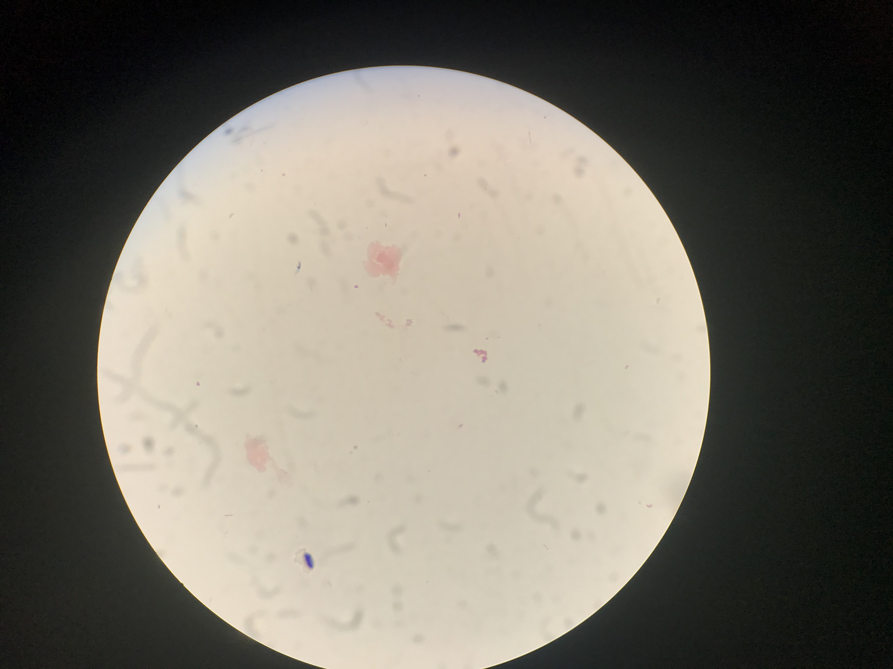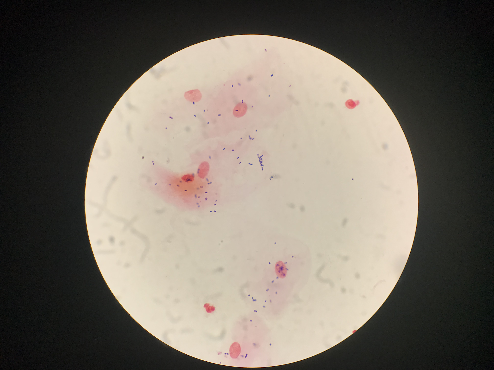

Reference (left) and passing-quality (right) Gram stains of cheek swabs

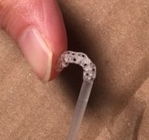

Tip flexibility

#### Preferred tip:

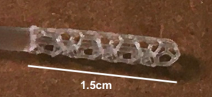

Hexagon (Carbon3D)

This was preferred because the hollowness captured a lot of material, while also being reasonably stiff. This was not a strong preference.

#### Also acceptable (no order):

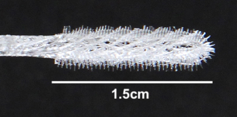

Bristle (OPT)

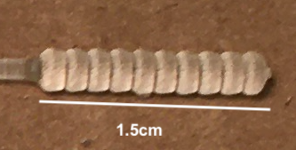

Honeydipper (FormLabs) 

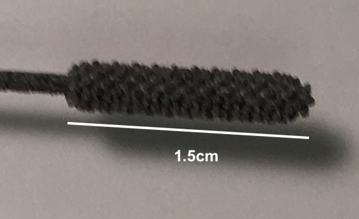

Cattail (HP print of ?USF design)

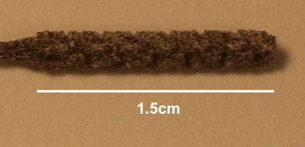

Brush (HP print of ?USF design)

Note none of these are [flocked]("https://github.com/HMS-RIC/Covid19-NP-Swab/#flock"). FDA says flock is **preferred** but **not required**.

### Shaft

#### Preferred shaft:

3mm-diameter tip, 1mm-diameter neck, 2.5mm-dimater handle and \~2mm breakpoint located 7cm from tip-end of swab.

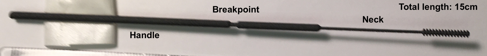

Archetypal (Abiogenix design (?), HP print)

### STL files

We do not have all stl files for all designs tested; what we have are [here](../design_files/). If you need one we don't have, please contact its [creator](np_swab_results.xlsx)). If you have an stl file to share, please email it to ccallah@bidmc.harvard.edu with *STL-FILE_\<identifier>_\<company>* in the subject field.

## Materials

### Handling

Key features (best performers in parentheses): 

- straight (HP > Carbon3D, FormLabs)
- smooth to the touch (Carbon3D > FormLabs, HP)
- dry (not sticky) (Carbon3D, HP, FormLabs)
- shaft: stiffness comparable to that of the inkholder of a bic pen
- neck and tip: flexible (capable of being bent 180 degrees without breaking, except at the breakopint) (HP, Carbon3D)
- breaks at breakpoint (should be somewhat difficult to do) (HP, FormLabs)
- no dust or other byproduct of printing process

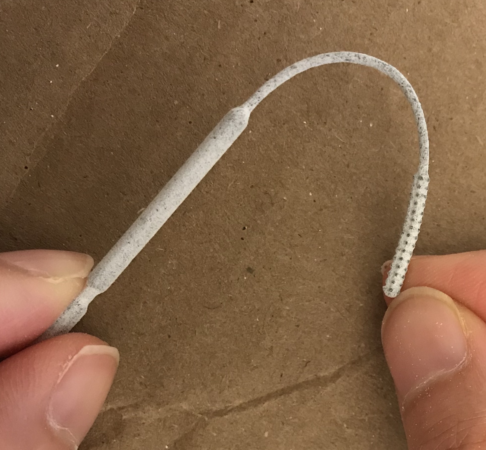

Neck flexibility

#### Preferred material:

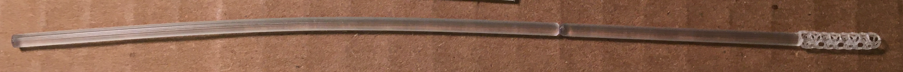

Keysplint Soft (Carbon3D)

### PCR compatibility

All materials tested so far (as of March 25, 2020) are PCR compatibile (see Excel for any codenames).

**Passed:** OPT, HP ("USF-1"), EnvisionTec (Nilson), FormLabs, Carbon3D, Pavel.

**Pending:** J_1 (Jifei), USF-2, B_1, S_1 (Seriano), EV.

**Not tested (failed clinical testing):** FT

**Not listed here:** materials from compound manufacturing (shaft plus glue plut flock/PDMS)

## Decontamination/sterilization and packaging

Autoclaving preferable, isopropanol or 70% ethanol washes with clean packaging acceptable.

Likely process: swabs produced and washed at scale, then:

- (option 1) take to a company with autoclavable paper packaging (e.g. Georgia-Pacific, 3M), or

- (option 2) packaged at manufacturer's site (e.g. EnvisionTec)

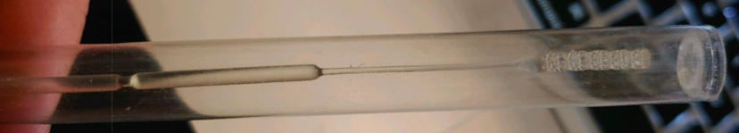

EnvisionTec's packaging

## Production volume

To my knowledge EnvisionTec, HP, FormLabs, and Carbon3D all have capacity for producing at least hundreds of thousands per day.

## Field testing, safety, market

**Field testing.** Field testing means using swabs on nasopharynx of people with confirmed SARS-CoV-2.

At BIDMC we have tested for appropriateness by (infectious disease/clinical pathologist) expert evaluation, and tested for sufficiency of collection using cheek swab and Gram stain as a surrogate for viral particle collection from nasopharynx. We have **not** field tested.

Field testing requires IRB approval.

To my knowledge Dr. Summer Decker at USF has field-tested at least on non COVID-19-suspected cases. She has an IRB.

I suggest as a first step other clinical sites model after USF's IRB and have their local IRBs cede review to USF as URB of record.

**Safety.** Note swabs are FDA Class-1 exempt devices; "garage testing" not advised.

**Market.** Several tip/shaft/material combinations will likely yield usable products. There will be a competitive market. A/B testing, marketing, contracting, etc. are beyond the scope of this document.

## Contact

Ramy Arnaout, MD, DPhil rarnaout@bidmc.harvard.edu 617-538-5681
