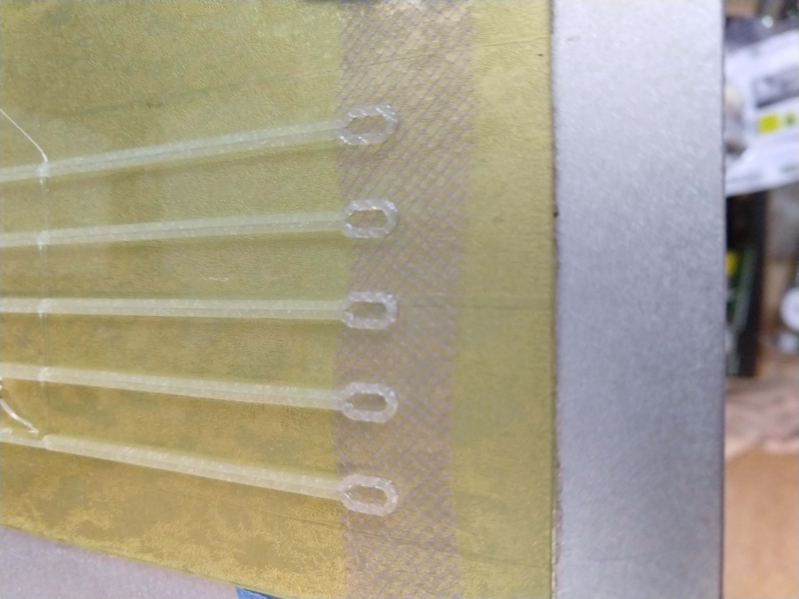
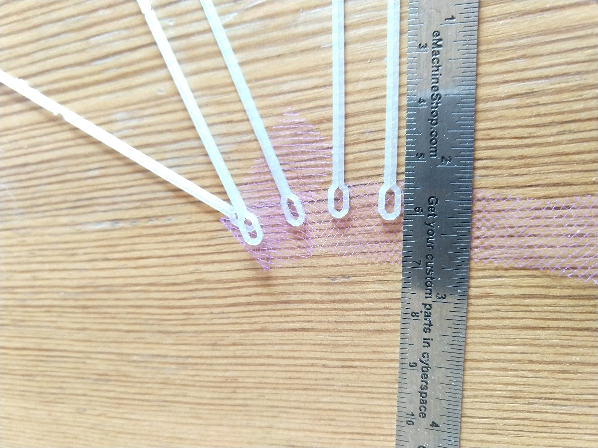
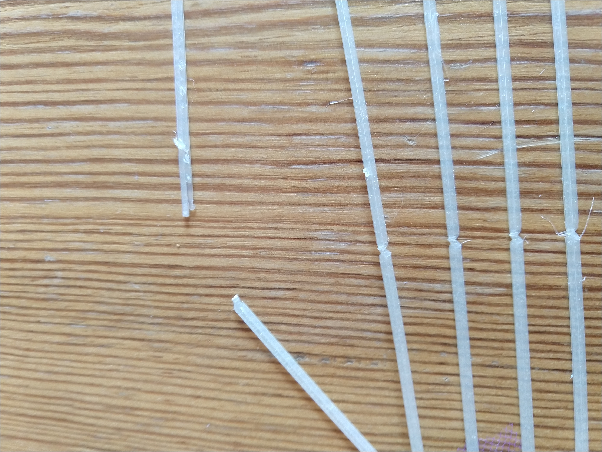

Inspired by Jenny's DIYSwab design this should be printable on any FDM that
can print a suitable material (perhaps nylon or PP). The process uses the
[3D printing on fabric](https://www.instructables.com/id/How-to-3D-Print-Onto-Fabric/)
technique to embed mesh inside a 3D printed swab.

The construction process involves:

1. printing a base layer for all swabs
1. while the printer is paused, placing the mesh onto the print surface (taped to the bed to keep it in place)
1. finishing the print, traping the mesh between the layers
1. letting the parts cool before removing them from the build plate
1. cutting away the excess mesh

For the v1 prototype, 5 swabs were printed in 6 minutes (not including heat-up/cool-down).
Dimensions were guessed (100 mm long shank, 50 mm break-off, ~4x2 mm inside loop).

Although the included [code](v1/gen_swab_gcode.py) generates gcode directly
the design could likely be made compatible with a standard slicer to improve
print quality by using retracts etc.

___

#### Identifier
BGV1Swab

#### Date of test
None

#### Test site
None

#### Picture
Please take a high-resolution picture of the **entire** item provided.

#### Material
Initial prototype in PLA and unknown mesh (only material on hand).

#### Process
Please include a brief description of the design process that an expert would understand well enough to reproduce. For repurposed swabs, write "commercial."

#### Creator (contact info and company)
Brett Graham brettgraham@gmail.com

#### Link to stl and cad files
Please send .stl and CAD files, which we will post.

#### Test 1: NP swab user evaluation (eg an ID doc), with comments
None

#### Test 2: Collection test
None

#### Test 3: PCR compatibility (and which protocol used)
None

