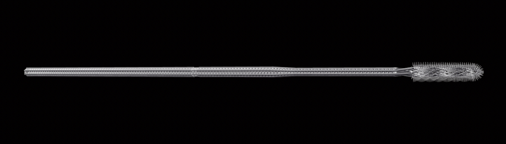
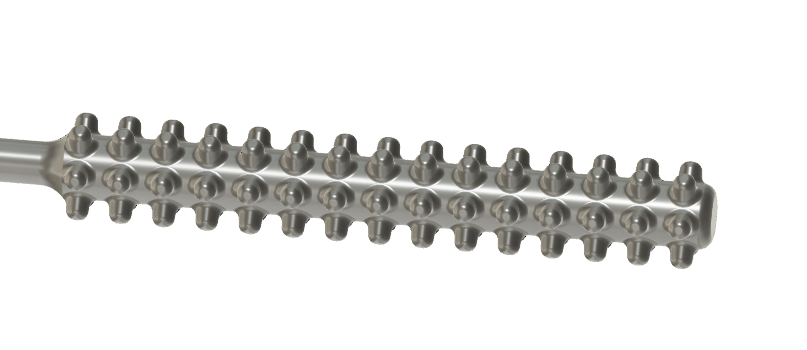
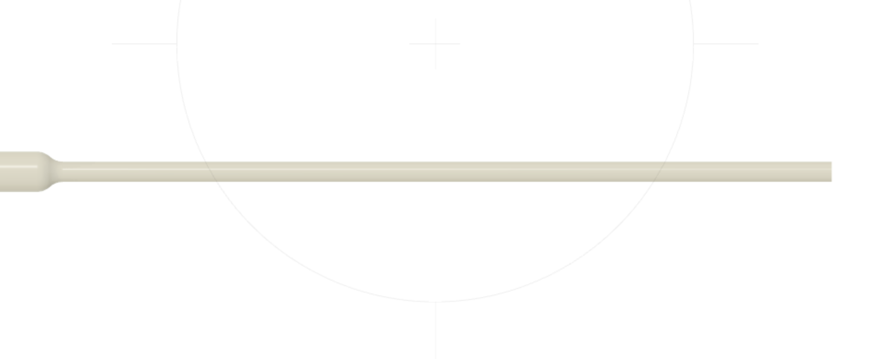
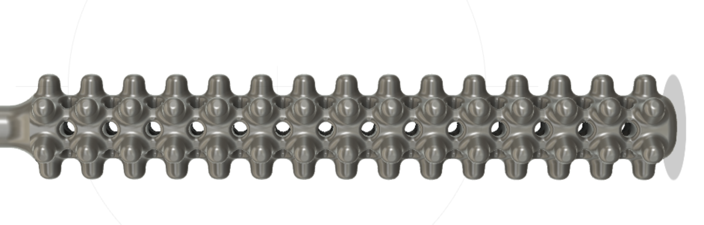

# Please upload and download models here

## Fathom Models
- Dr. Summer Decker (sdecker@usf.edu)
- Jonathon Ford (jmford2@usf.edu )
- designed for formlabs surgical material; can autoclave; clinician tested

1) 

## Fathom Models
- Anne Pauley (anne@studiofathom.com)
- Chris Blower (cblower@studiofathom.com)
- Tony Slavik (tony@studiofathom.com)
- Sldparts / Step / Stl files;
- designed to for capillary action, surface tension of fluid retention

1) 
2)
3)

## OPT Industries Models
- Jifei Ou (jifei@optindustries.com)
- stl too big to upload to GitHub. dropbox link below

https://www.dropbox.com/s/ce44jchs8vurto6/OPTIndustries_Swab_CilliaReinforced.stl?dl=0

## Abiogenix Models
- Goutam Reddy (greddy@abiogenix.com)
- Fusion 360 links to CAD models

1) nasopharyngeal swab nubs V1:  https://a360.co/2Qyh2GE
   - 
   - bristle with 6x15 0.7mm dia raised nubs,
   - bristle surface area 129 mm^2
   - need to fix shaft so max-stress point is at snap-off point, not on bristle shaft
    
2) nasopharyngeal swab round V1:  https://a360.co/2wpGHui
   - 
   - featureless bristle: 1.25mm diameter shaft
   - bristle surface area: 61 mm^2
   - LESS SURFACE AREA BUT CAN BE USED TO ATTACH EXTERNAL BRISTLE OR COATING
   
3) nasopharyngeal swab nubs holes V1: https://a360.co/2U5CzbK
   - 
   - bristle with 6x15 0.7mm dia raised nubs, and 0.35mm dia holes
   - bristle surface area: 167 mm^2
   - PREFER NOT TO USE MODELS WITH HOLES INSIDE TO REDUCE POST-PROCESSING

## Wyss Institute Models
- *find author contact info*
- *find link to original model files*
1) nasopharyngeal swab helix: *find link to model*
2) nasopharyngeal swab linear balls: *find link to model* 
